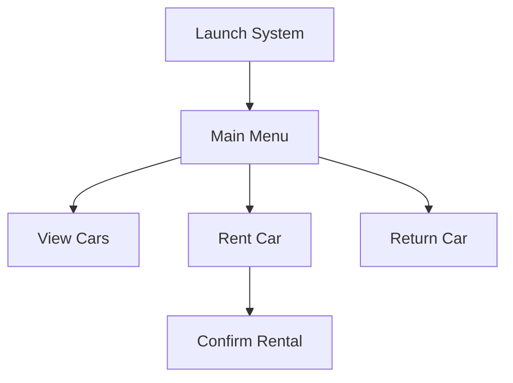

# 🚗 Car Rental Management System  

**Developed by:** Biruk Tibebe Solomon  
**Version:** 1.0  

## 📋 Table of Contents  
1. [System Overview](#-system-overview)  
2. [Key Features](#-key-features)
3. [Data Management](#-data-management)
4. [Getting Started](#-getting-started) 
5. [Technical Specifications](#-technical-specifications)  
6. [Usage Guide](#-usage-guide)  
7. [Installation](#-installation)  
8. [Support](#-support)  

---

<a id="-system-overview"></a>
## 🌟 System Overview  

A robust C++ application designed for efficient vehicle rental management. The system provides:  

- Real-time inventory tracking  
- Intuitive console interface  
- Persistent data storage  
- Advanced search capabilities  

**Target Users:**  
- Rental shop managers  
- Inventory clerks  
- Small business owners  

---

<a id="-key-features"></a>
## ✨ Key Features  

### 🖥️ Dashboard Operations  
| Feature | Description |  
|---------|-------------|  
| **Inventory View** | Filter available/rented vehicles |  
| **Smart Search** | Find cars by ID or partial model name |  
| **Rental Processing** | Single-step rent/return operations |  

<a id="-data-management"></a>
### 🔄 Data Handling  
- Automatic daily backup creation  
- Conflict-free concurrent access prevention  
- Data integrity validation  
- **ID Model PricePerDay IsRented**
  - [integer] [string] [double] [0/1]

---
<a id="-getting-started"></a>
## 🚀 Getting Started  

### 📋 Prerequisites  
- **Compiler:** GCC/G++ (MinGW for Windows)  
- **Disk Space:** 500KB minimum  
- **Permissions:** Read/write access in execution directory

<a id="-technical-specifications"></a>
## 💻 Technical Specifications  
### System Architecture  

<a id="-usage-guide"></a>

## Usage Guide
Workflow Example
- Launch system
- Select operation from menu
- Follow on-screen prompts

<a id="-installation"></a>
### ⚙️ Installation  
```bash
# Clone repository (if applicable)
git clone https://example.com/car-rental.git

# Compile with C++11 standards
g++ -std=c++11 -o rental main.cpp

# Execute program
./rental
```

<a id="-support"></a>
## 📧 Support & Contact
- 🛠️ Technical Support
**Email**: biruksolomonti.com
**Hours**: Mon-Fri 9AM-5PM 

- ✉️ Developer Contact
**Biruk Tibebe Solomon**
**📧biruksolomonti@gmail.com**


 
